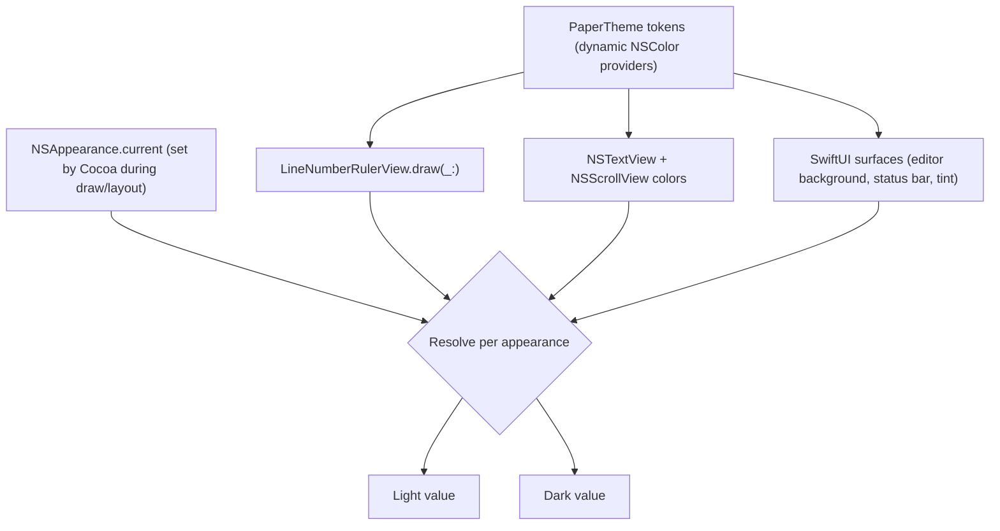

# Adaptive Dark Mode Theme - Plan

## Goal Capsule

- **Objective:** A person using Paper on a Mac in dark appearance sees a deliberate, legible dark editor — dark canvas, gutter, and status bar, with a readable caret, selection, and line numbers — and a running window updates when the system appearance changes, without the light theme shifting.
- **Means:** one adaptive token set in `Support/PaperTheme.swift` that resolves per appearance (KTD1).
- **Authority:** R-IDs own product behavior; KTDs own implementation mechanism; a unit overrides neither.
- **Execution profile:** code, standard depth.
- **Stop conditions:** stop and ask if a surface must be restructured rather than recolored (e.g. the status bar's material), or if the test target cannot import the app target and the library-extraction fallback is needed.
- **Finishing the work:** focused commits on `master`, matching this repo's existing history; no pull request unless asked.

---

## Product Contract

### Summary

Replace Paper's hardcoded light-only palette with one adaptive token set so the editor, line-number gutter, status bar, and accent render correctly in dark appearance and follow a live system appearance change, leaving the light appearance as it ships today.

### Problem Frame

Every color in `Support/PaperTheme.swift` is a static literal — `editorBackground` at 0.99/0.99/0.98, `nsEditorText` at 0.08 near-black, and so on. Those values are applied unconditionally to the `NSTextView` and the line-number ruler, so the document stays light no matter what the system is doing. The surrounding chrome does not: the status bar uses `.ultraThinMaterial`, the title hover uses `Color(nsColor: .quaternaryLabelColor)`, and the toolbar and window frame are system-drawn. In dark appearance that produces a dark window frame around a light editor, and the caret and line numbers sit at the wrong end of the contrast range for the surface they are on.

### Requirements

**Dark appearance**

- R1. Every editor surface renders in the appearance the system is currently in: the document canvas, the line-number gutter, the gutter divider, the status bar, and the caret.
- R2. Switching appearance while Paper is running repaints every surface without a relaunch, including while text is selected or an input-method composition is in progress.
- R3. The dark canvas is a warm near-black and the gutter sits a step lighter than the canvas, preserving Paper's paper-like identity rather than collapsing to a neutral system gray.
- R4. Body text against the canvas, and line numbers against the gutter, each reach at least a 4.5:1 contrast ratio in both appearances.
- R5. The accent used for the caret, the selection fill, and the window tint stays legible on the dark canvas.

**Light appearance**

- R6. The light appearance renders the values Paper ships today, unchanged.

**Scope**

- R7. Only the editor, gutter, status bar, and accent adapt; the window frame and toolbar keep their system defaults.
- R8. Paper follows the system appearance and offers no in-app light/dark override.

### Key Decisions

- **Adaptation is limited to the editor surfaces** — the window chrome already adapts correctly through system materials, and recoloring it would fight AppKit. Governs R7.
- **No in-app appearance override** — following the system is the macOS default for a minimal editor, and an override would add a settings surface this app does not have. Governs R8.

### Acceptance Examples

- AE1. Covers R2, R5. **Given** Paper is frontmost with a document open and a range of text selected, **when** the system appearance switches from light to dark, **then** the canvas, gutter, and status bar all repaint dark in the same window, the selection stays visible against the dark canvas, and the caret remains distinguishable from the text around it.

### Scope Boundaries

- Not restyling the window frame, titlebar, or toolbar.
- Not adding an in-app light/dark/system picker.
- Not introducing an asset catalog; the palette stays defined in code.
- Not adding appearance-specific high-contrast palettes beyond letting the system's high-contrast appearances resolve through the same provider.

#### Deferred to Follow-Up Work

- A designed light-theme refresh.
- A theming or editor-preferences surface.
- Syntax highlighting, which would need its own per-appearance token set.

---

## Planning Contract

### Key Technical Decisions

- KTD1. **The palette is a code-defined dynamic `NSColor` per token, exposed as both an `NSColor` and a bridged SwiftUI `Color`** (session-settled: user-approved — chosen over macOS semantic system colors: a custom warm dark keeps Paper's identity, at the cost of hand-maintained values and hand-verified contrast). Each token becomes one provider that returns the light or dark value for the appearance it is handed, covering the vibrant and high-contrast appearance variants alongside plain aqua and darkAqua.
- KTD2. **Adaptation relies on AppKit resolving dynamic colors at draw time, not on observing appearance changes.** A dynamic `NSColor` resolves against `NSAppearance.current`, which Cocoa sets automatically inside `draw(_:)`, `layout()`, `updateConstraints()`, and `updateLayer()`. The ruler already fills inside `draw(_:)`, so it adapts with no plumbing.
- KTD3. **No resolved color value is cached, and no color is resolved outside a drawing context.** `CGColor` does not adapt and must never be stored; reading a dynamic color's components outside a draw cycle returns whichever appearance was current at that moment, which is what produces the "launched in dark, painted light" failure.
- KTD4. **Authored dark values, not inverted light values.** `usesAdaptiveColorMappingForDarkAppearance` stays off — it maps component-based colors by inverting brightness and would fight the hand-authored palette.
- KTD5. **Contrast is verified by a test, not only by eye.** The light and dark variants of each text token are resolved explicitly and checked against a 4.5:1 ratio, which is the only part of this work with a mechanical pass/fail.

KTD1 and KTD2 are close to the "two structurally distinct mechanisms" bake-off trigger, but the decision does not qualify: the palette lives in one file behind stable token names, so reversing to semantic system colors later is a localized edit rather than a data shape or interface other work builds on.

### High-Level Technical Design

Component topology and where resolution happens:

Appearance variants each token must answer for:

| Appearance | Variant | Expected resolution |
|---|---|---|
| Light | `.aqua` | Shipped light value (R6) |
| Light | `.vibrantLight` | Light value |
| Light | `.accessibilityHighContrastAqua` | Light value |
| Dark | `.darkAqua` | Authored dark value (R3) |
| Dark | `.vibrantDark` | Dark value |
| Dark | `.accessibilityHighContrastDarkAqua` | Dark value |

### Assumptions

- The status bar's `.ultraThinMaterial` and the `Color(nsColor: .separatorColor)` divider remain readable over a dark canvas without replacement; if a screenshot shows otherwise, U4 replaces the material with a token-backed surface rather than tinting the material.
- Line numbers keep the same monospaced 16pt metrics in dark appearance, so the ruler's existing baseline alignment is unaffected.

---

## Implementation Units

### U1. Register a test target

- **Goal:** The package can run tests, so the contrast rules in U2 have an automated home.
- **Requirements:** none directly; enables R4 and R6 verification.
- **Dependencies:** none.
- **Files:** `Package.swift`, `Tests/PaperTests/PaperThemeTests.swift`
- **Approach:** Add a `PaperTests` target and a test target product wiring entry to `Package.swift`, and a minimal `PaperThemeTests` suite. Import the app target for testability; if the executable target cannot be imported, take the fallback in the risk section rather than dropping the tests.
- **Patterns to follow:** none in-repo — this is the repo's first test target, which `AGENTS.md` already prescribes.
- **Test expectation:** none -- harness wiring only; verified by `swift test` executing the suite.
- **Verification:** `swift test` runs and reports the suite.

### U2. Adaptive theme tokens

- **Goal:** Every Paper color is one token that resolves to a light or dark value, with the dark palette defined once and the light palette identical to what ships today.
- **Requirements:** R1, R3, R4, R5, R6
- **Dependencies:** U1
- **Files:** `Support/PaperTheme.swift`, `Tests/PaperTests/PaperThemeTests.swift`, `docs/editor-ui-troubleshooting.md`
- **Approach:**
  1. Keep the existing token names and the existing dual `Color` / `NSColor` structure, so call sites in U3 and U4 do not change shape.
  2. Replace each static literal with a single provider that branches on the appearance it is handed, returning the light or dark variant. Cover the vibrant and high-contrast names, not just `.aqua` and `.darkAqua`.
  3. Define the dark palette: warm near-black canvas, gutter a step lighter, muted warm-gray numbers, near-white body text, and a lightened accent for the caret, selection, and tint.
  4. Record the appearance rules from KTD2 and KTD3 in `docs/editor-ui-troubleshooting.md` next to the existing editor notes, including the "never resolve outside a drawing context" hazard.
- **Patterns to follow:** the existing `PaperTheme` `Color` + `NSColor` pairing; the light/dark provider shape that switches on `NSAppearance.name` across aqua, darkAqua, vibrant, and high-contrast variants.
- **Test scenarios:**
  - Light invariance: resolving each token under `.aqua` returns exactly the components Paper ships today.
  - Palette ordering: in dark, the canvas resolves darker than the light canvas, and the gutter resolves lighter than the dark canvas.
  - Contrast: body text against canvas, and gutter numbers against gutter, are at least 4.5:1 in both `.aqua` and `.darkAqua`.
  - Provider distinctness: the same token resolves to different values under `.aqua` and `.darkAqua`.
  - High contrast: each token resolves under `.accessibilityHighContrastDarkAqua` without falling back to its light value.
- **Execution note:** the palette is a visual judgment — settle the final values against rendered screenshots before locking the contrast thresholds into the test, or the test will encode a number nobody looked at.
- **Verification:** `swift test` passes; `swift build` is clean.

### U3. AppKit editor surfaces pick up the tokens

- **Goal:** The text view, its scroll view, and the line-number ruler draw from the adaptive tokens and repaint when the appearance changes.
- **Requirements:** R1, R2
- **Dependencies:** U2
- **Files:** `Support/LineNumberTextEditor.swift`, `Support/LineNumberRulerView.swift`
- **Approach:**
  1. Replace the static color assignments in `makeNSView` — text color, background, insertion point, selection attributes, scroll view background — with the adaptive tokens.
  2. Replace the ruler's static gutter fill, divider fill, and number attribute color with the adaptive tokens.
  3. Leave `usesAdaptiveColorMappingForDarkAppearance` off (KTD4), and do not add an appearance observer for correctness — the ruler's cached attribute dictionary holds an `NSColor`, which still resolves at draw time (KTD2).
  4. Keep the ruler's existing `invalidateLineNumbers()` path as the repaint trigger so the gutter redraws with the rest of the window.
- **Patterns to follow:** the existing explicit-color block in `makeNSView`; the ruler's `setFill()` + `bounds.fill()` draw path, which already runs inside a drawing context.
- **Test scenarios:**
  - Launch in dark: canvas, gutter, divider, and caret all render dark; no light surface remains.
  - Launch in light: pixel-comparable to the current build.
  - Live switch: with a selection active, toggling the system appearance repaints canvas, gutter, and divider in the same window, with the selection and caret still visible (covers AE1).
  - IME: switching appearance mid-composition does not disturb the marked text.
- **Execution note:** prefer install/runtime smoke verification over unit coverage here; the rendered result is the proof.
- **Verification:** `./script/build_and_run.sh --verify`, then screenshots in both appearances with a document loaded.

### U4. SwiftUI surfaces pick up the tokens

- **Goal:** No static light color remains in the SwiftUI layer, and the status bar and title affordances stay legible on the dark canvas.
- **Requirements:** R1, R5, R7
- **Dependencies:** U2
- **Files:** `Views/EditorView.swift`, `Views/ContentView.swift`, `App/PaperApp.swift`
- **Approach:**
  1. Route the editor background in `EditorView` through the adaptive canvas token.
  2. Leave the status bar's `.ultraThinMaterial` and the `.separatorColor` divider in place, but confirm the status text and divider still read over the dark canvas; replace the material with a token-backed surface if they do not.
  3. Confirm the title hover fill and dirty dot remain visible in dark, and that the window tint uses the adaptive accent.
- **Patterns to follow:** the existing semantic-color usage in `ContentView`; the macOS 26 `glassEffect` / pre-26 material branch in `EditorView`, which stays as-is.
- **Test scenarios:**
  - Status bar text and divider remain legible over the dark canvas.
  - Title hover highlight and dirty dot are visible in dark appearance.
  - Window tint reads as the dark accent rather than the light one.
  - No static light literal remains in `Views/` or `App/`.
- **Execution note:** smoke-verify by screenshot; a grep for remaining literals is a useful pre-check but not proof.
- **Verification:** `./script/build_and_run.sh --verify`, screenshots in both appearances.

---

## Verification Contract

| Gate | Command | Applies to |
|---|---|---|
| Compiles | `swift build` | all units |
| Token and contrast rules | `swift test` | U1, U2 |
| App launches and stays running | `./script/build_and_run.sh --verify` | U3, U4 |
| Manual appearance check | Screenshot the window in light and dark with a document loaded; confirm canvas, gutter, divider, status bar, caret, and selection | U3, U4 |

No release or packaging gate applies — the repo has no release pipeline and `script/build_and_run.sh` is the only build entry point.

## Definition of Done

- R1–R8 hold, and AE1 passes on a live appearance switch.
- `swift build` and `swift test` are clean; the contrast assertions pass in both appearances.
- The light appearance is unchanged from the shipped build.
- No static light literal remains in `Support/`, `Views/`, or `App/`.
- `docs/editor-ui-troubleshooting.md` records the appearance-resolution rules and the draw-context hazard.
- Cleanup: any experimental palette values, diagnostic prints, or temporary contrast probes used while settling the dark values are removed from the diff before the work is declared done.
