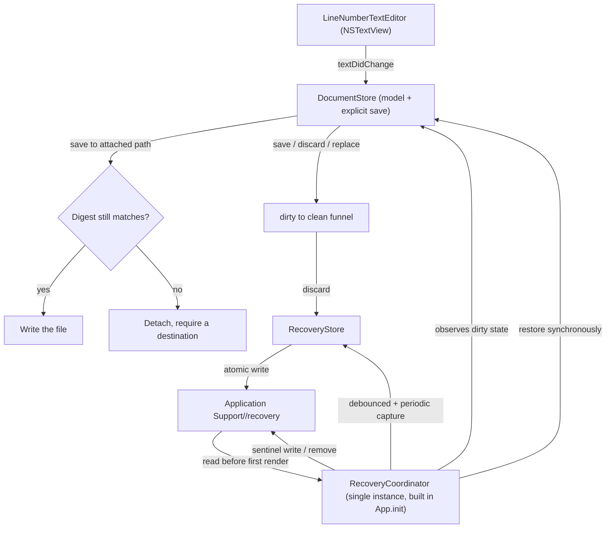
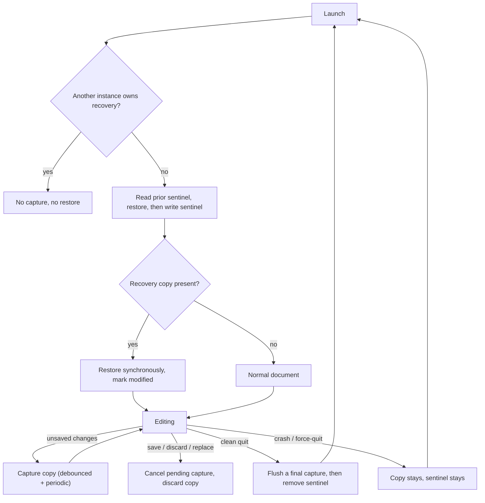

# Unsaved Work Recovery - Plan

## Goal Capsule

- **Objective:** A person who types into Paper and then quits, restarts the machine, or loses the app to a crash or force-quit finds their text back in the window on the next launch, presented as unsaved work they can still save or discard — and never finds a recovered copy written over a file that changed while Paper was closed.
- **Means:** a continuously written, app-managed recovery copy of the in-progress document, restored at launch (KTD1, KTD2).
- **Authority:** R-IDs own product behavior; KTDs own implementation mechanism; a unit overrides neither.
- **Execution profile:** code, standard depth.
- **Stop conditions:** stop and ask if the recovery copy cannot be made atomic on the target filesystem, or if a restore cannot be told apart from a normal launch without changing the app's document model.
- **Finishing the work:** focused commits on `master`, matching this repo's existing history; no pull request unless asked.

---

## Product Contract

### Summary

Give Paper a recovery path for unsaved work: while a document has unsaved changes, an app-managed copy is kept current on disk, and the next launch restores it as modified work. The user's own files are never written except by an explicit Save, and a restored copy can never be saved over a file that changed while Paper was closed.

### Problem Frame

`Stores/DocumentStore.swift` keeps the document in memory and writes to disk only when the user saves. There is no quit-time prompt either — `App/PaperApp.swift` installs no application delegate and no termination hook — so quitting or restarting the machine with unsaved text discards it silently. The app is not document-based (`WindowGroup` over one shared `DocumentStore`, not `DocumentGroup`), so none of AppKit's autosave machinery applies, and macOS's own window restoration is discarded on force-quit. The result is that the one thing a text editor must not do — lose typing — happens on the most ordinary of actions.

A recovery feature carries its own hazard: a copy that outlives the document it came from can be restored over newer work, or can shadow a file the user has since edited elsewhere. The requirements below treat that as part of the same problem rather than a follow-up.

### Requirements

**Recovery capture**

- R1. While the document has unsaved changes, an app-managed recovery copy is kept current on disk, so at most a short, bounded window of typing can be lost.
- R2. Untitled documents, which have no file to write to, are captured by the same mechanism.
- R3. The recovery mechanism never writes to the user's document file; that file changes only when the user saves.

**Restore**

- R4. On launch, when a recovery copy for unsaved work exists, its text is restored into the window and presented as modified, unsaved work.
- R5. Restore does not depend on how the previous session ended: a normal quit, a logout or machine restart, a crash, and a force-quit are all covered.
- R6. A restored document keeps its title and, when it had a file, that file's location, so a subsequent Save writes back to the original file.
- R16. Restore completes before the first window is presented, so the document never visibly changes underneath the user after launch.

**Discard**

- R7. A recovery copy is discarded only when the document is saved successfully, the user explicitly discards it, or the in-progress document is replaced — never merely because the app quit.
- R8. After a successful save, no stale copy is restored on the next launch.

**Recovery safety**

- R11. A restore must never arm Save over a file that changed since the copy was captured. When the original file is missing, or its content no longer matches what the copy was taken from, the restored work is detached from that path and presented as recovered work rather than as an edit of the file.
- R18. The file check is re-validated immediately before every save to an attached path, not only at restore, so a file that changes while Paper is open cannot be overwritten by a save. On a mismatch the document detaches and the user must choose a destination.
- R12. Whenever a recovery copy exists, a reachable, confirmed action discards it, clearing the copy and returning the document to a fresh state. A user must never be unable to clear recovered work, and the action stays reachable after any notice is dismissed.
- R13. The notice that announces a recovery is dismissible without discarding the recovered text.
- R14. Replacing the in-progress document — a new document, opening a file, or Save As to a new file — is a recovery boundary: any pending capture is cancelled and the previous copy is discarded.
- R15. A failed capture is surfaced to the user, naming the time of the last successful write, rather than silently leaving an older copy in place.
- R17. Recovery state is owned by exactly one running instance; a second instance must neither capture into nor restore from the first instance's copy.

**Failure handling**

- R9. A failed or interrupted recovery write never corrupts the user's file and never blocks editing.
- R10. If the recovery copy cannot be read at launch, the app opens normally and reports the problem instead of failing to launch.

### Key Decisions

- **A recovery copy only — never autosave in place** (session-settled: user-approved — chosen over overwriting the user's file as they type, and over splitting the behaviour by whether a file exists: keeping the file untouched preserves the meaning of Save and guarantees that nothing typed can silently alter a file the user owns). Governs R3.
- **Recovery is continuous capture, not a quit-time save prompt.** A prompt is the smaller change and would cover an ordinary restart, but it cannot cover a crash, a force-quit, or a logout that kills an unresponsive app — the cases where work is most likely lost — and it asks the user to make a decision at the worst moment. Continuous capture also means the prompt becomes unnecessary rather than merely deferred. Governs R1, R2, R5.
- **Restore is not gated on detecting a crash** — the copy exists whenever there is unsaved work, so gating the restore on "did the last session end abnormally" would silently drop work after an ordinary restart, which is the exact case being fixed. Governs R5.
- **Recovered work is never silently reattached to a file that moved on** — the safe direction of a conflict is to detach and label it, because the alternative writes stale text over newer work. Governs R11, R18.
- **The single-document, shared-store model is accepted as frozen for this work.** Making the app document-based is a document-model change that this feature does not need, and taking it on would rework the header, Open, and Save flows. Governs R17.

### Acceptance Examples

- AE1. Covers R4, R5, R7. **Given** an untitled document with unsaved text and no file on disk, **when** the app is quit normally, or the machine restarts, or the process is force-quit, and Paper is then relaunched, **then** the text is back in the window marked as modified, no file has been created on disk, and the copy remains until the user saves or discards it.
- AE2. Covers R7, R8. **Given** a document opened from a file and then edited without saving, **when** the user saves it, **then** the recovery copy is discarded and the next launch opens that file normally with no restore.
- AE3. Covers R11. **Given** a document open from a file with unsaved edits, and the file is then modified by another program while Paper is closed, **when** Paper is relaunched, **then** the recovered text is presented detached from that file, and saving it cannot overwrite the newer file without the user choosing a destination.
- AE4. Covers R18. **Given** a document restored onto an attached file, and that file is then modified by another program while Paper stays open, **when** the user saves, **then** the save does not overwrite the file and the document detaches instead.

### Scope Boundaries

- Not autosaving into the user's file, and not creating a file for an untitled document without the user naming one.
- Not version history, version browsing, or reverting to an earlier revision.
- Not iCloud or cross-device sync.
- Not multi-document recovery: the app shares one `DocumentStore` across every window, so recovery covers the single in-progress document.
- Not persisting caret position, scroll offset, selection, or window geometry.
- Not encrypting the recovery copy; the copy holds the document in plain text, which the documentation must state.

#### Deferred to Follow-Up Work

- A quit-time "save changes?" prompt. Continuous capture makes it unnecessary; it would become worthwhile alongside real multi-document support.
- Recovery for several concurrently open documents, which needs the document model to change first.
- Encrypting the recovery copy, if the app ever handles sensitive text.
- Orphan cleanup across many files, which only becomes a concern once recovery is per-document rather than single-document.

---

## Planning Contract

### Key Technical Decisions

- KTD1. **One recovery file per in-progress document, under Application Support, written atomically.** It holds the document text plus the identity needed to restore it — title, the file location when there was one, and whether one existed (R6). Writing to a temporary file and swapping it in means an interrupted write leaves the previous copy intact rather than a half-written hybrid (R9). *Rejected:* writing in place (a crash mid-write leaves an unreadable copy) and keeping the copy in memory only (which is what the app does today).
- KTD2. **Capture is debounced on edit and backed by a periodic safety net, and it is synchronous only for bounded documents.** A short delay after typing stops coalesces a burst of keystrokes into one write, and an interval tick guarantees progress even during continuous typing. The debounce and tick intervals are injectable so tests do not sleep (R1). Encoding and writing move off the main actor above a bounded document size, so a large paste cannot hitch the typing path this design exists to protect. *Rejected:* writing on every keystroke (write amplification and constant partial-file churn) and periodic-only capture (loses everything typed before the first tick).
- KTD3. **A clean-exit sentinel decides the wording of the restore, never whether the copy exists or what happens to it.** A marker file is written at launch and removed on graceful termination. Because the copy is written continuously and discarded only on save, explicit discard, or replacement (KTD4), a clean restart still restores unsaved work (R5, R7). The sentinel can survive an abrupt logout, so no behaviour depends on it; it only selects whether the notice says the app quit unexpectedly or that work was recovered from the last session. *Rejected:* gating the restore on the sentinel (drops work after a clean restart) and relying on the OS's own restoration (discarded on force-quit).
- KTD4. **The recovery copy is discarded on save, explicit discard, or document replacement, and on nothing else.** Quitting, closing the window, and terminating are not discard events. *Rejected:* discarding on quit or window close, which is what makes the user's ordinary restart lose work.
- KTD5. **Recovery is hand-rolled rather than adopting `DocumentGroup` or a raw `NSDocument` subclass.** The alternative is closer than it first appears: `autosavesInPlace` is an overridable property, so an `NSDocument` subclass could keep autosave-elsewhere only and satisfy R3, and it would bring change tracking, the dirty funnel (KTD7), the New/Open/Save As lifecycle (R14), and per-window documents with it. It is rejected on two grounds the API does not remove: adopting it makes the app document-based, which is a document-model change this feature does not need and which would rework the header, Open, and Save flows; and it would still need explicit work to reach crash and force-quit recovery, which is the case being fixed. This is not a stepping stone — a hand-rolled recovery store is discarded, not reused, if Paper later adopts `NSDocument`, so that move should be made deliberately and before further investment in hand-rolled document machinery.
- KTD6. **The payload carries a format version, a content digest of the source file, and the time of the last successful write.** The digest is what lets a restore detect that the file moved on (R11) and what lets a save re-validate before writing (R18); the timestamp is what a failed capture reports (R15); the version keeps a future payload change from silently discarding recoverable work (R10). The digest is a cryptographic hash of the file's bytes — deliberately not a modification time or size, which a same-size edit, a preserved timestamp, or a checkout can all defeat. It is recorded once when the document is attached to a file and is never refreshed by a capture, because a refreshed digest would absorb an external change and defeat the whole check. *Rejected:* a text-only payload, which cannot detect any of these, and a metadata-based fingerprint, which cannot detect a same-size or timestamp-preserving edit.
- KTD7. **`isDirty` may only become false through one funnel that always makes an explicit recovery decision.** The store, the exporter path in `Views/ContentView.swift` (which currently sets the file location, title, and flag directly at `Views/ContentView.swift:44-47`), and document replacement all route through it. Without this, a Save As or an Open strands a copy on disk and the next launch restores stale text as modified work (R8, R14). *Rejected:* leaving the existing direct assignments in place and hoping each call site remembers to discard.
- KTD8. **One recovery coordinator, constructed once in `App/PaperApp.init()`, owns capture, scheduling, sentinel, and ownership.** Because a single `DocumentStore` is shared by every window, scheduling inside the store or a view would give one writer per window for one file. Constructing it in `init` is also what makes the restore synchronous with the first render (R16) rather than a flash-then-replace. *Rejected:* putting timers and lifecycle hooks inside `DocumentStore` (couples the model to process lifecycle) or in `ContentView` (N writers for one file, and restore after first render).
- KTD9. **Recovery ownership is exclusive to one running instance.** An owner marker in the recovery directory makes a second instance skip both capture and restore rather than race the first. *Rejected:* relying on the atomic write alone, which prevents torn bytes but not one instance's copy overwriting another's payload.
- KTD10. **Termination is handled through an `NSApplicationDelegateAdaptor`, not a notification observer.** Under Swift 6 strict concurrency the notification's block is `@Sendable` and cannot synchronously call the main-actor flush the design requires, so the final capture runs in a main-actor-isolated `applicationWillTerminate(_:)`. *Rejected:* `NSApplication.willTerminateNotification` with an isolation escape, which trades a compile-time guarantee for a runtime assumption in the one path that must not fail.

### High-Level Technical Design

Components and how the copy flows:

Document lifecycle, showing why a clean quit still restores:

What each ending does to the copy:

| Session ending | Copy on disk | Next launch |
|---|---|---|
| Save, discard, or document replaced | discarded | Normal open, no restore |
| Quit / logout / restart with unsaved work | present | Restore as modified work |
| Crash or force-quit | present | Restore as modified work |

The sentinel's presence is deliberately absent from this table: it may or may not survive an abrupt logout, and nothing depends on it beyond the notice's wording.

**State lifecycle invariants.** These are the ordering rules the units must honour:

- A save cancels any pending capture and discards synchronously on the main actor, so a capture cannot land afterwards and resurrect a copy (U2).
- The periodic tick gates on the document being dirty, so it stops writing after a save (U2).
- A capture never refreshes the source-file digest, so an external change cannot be absorbed into it (U1, U2).
- Restore runs synchronously in `App.init()` before the body builds the scene, so no window flashes the welcome text (U3).
- Launch reads the prior sentinel state *before* writing its own (U3).
- Graceful termination flushes one final capture *before* removing the sentinel (U3).
- A pending capture from a replaced document is cancelled, so it cannot be restored against the new document (U2, U3).
- `isDirty` never reverts on undo-to-original, so a copy may be restored whose text already matches the file; this is accepted, and the plan does not attempt to narrow it (U2).

### System-Wide Impact

- **Lifecycles touched:** launch, edit, save, Save As, open, new document, last-window close, graceful terminate, crash, force-quit, logout, and machine restart.
- **Shared state:** one `DocumentStore` is shared by every window, so there is one recovery copy and one writer. The notice is driven by shared store state and therefore renders in every open window rather than being per-window state.
- **Filesystem surfaces:** a recovery directory under Application Support keyed by bundle id, containing the copy, the sentinel, the instance owner marker, and the temporary file used for the atomic swap.
- **New composition-root coupling:** a coordinator and an application delegate in an app that currently has neither.
- **Store interface change:** the dirty-to-clean funnel (KTD7) adds a required decision to every path that currently clears the flag, including the exporter completion in `Views/ContentView.swift`; and `save` gains a pre-write digest check (R18).
- **User-visible surfaces added:** a recovery notice and a persistent discard command, both of which must read correctly in light and dark appearance and must not disturb the header layout or the line-number gutter.
- **Platform behaviour relied on:** graceful termination being observable through an application delegate; the OS's own window restoration is explicitly *not* relied on, since it is discarded on force-quit.
- **Data sensitivity:** the copy is the document in plain text at rest under Application Support, readable by anything running as the user. Encryption is deferred, and the documentation must say so.

### Assumptions

- The app is not sandboxed (the bundle is assembled by `script/build_and_run.sh` with no entitlements), so Application Support is directly writable. If the app is ever sandboxed, the same directory remains valid but moves inside the container.
- `Bundle.main.bundleIdentifier` is available because the app always runs from the assembled bundle; the store falls back to a fixed folder name when it is nil, so running the bare binary and the test bundle do not write into the real Application Support path.
- A logout or machine restart reaches the app as an ordinary quit, so it is covered by the same termination path as ⌘Q. A logout that kills an unresponsive app is covered by the continuous capture instead, and is not separately gated.
- Encoding and writing a document below the size bound takes well under the debounce interval, so capture stays synchronous there without hitching typing. The bound is chosen during implementation against a measured write time and is exercised by a large-document test.

---

## Implementation Units

### U1. Recovery store

- **Goal:** A primitive that can write, read, and discard one document's recovery copy atomically, with its directory injectable.
- **Requirements:** R1, R3, R6, R9, R10, R11, R18
- **Dependencies:** none.
- **Files:** `Stores/RecoveryStore.swift`, `Tests/PaperTests/RecoveryStoreTests.swift`
- **Approach:**
  1. Model the payload as the document text plus its identity — title, file location when one exists, whether the document had a file — plus the format version, the source-file content digest, and the time of the last successful write (KTD6).
  2. Compute the digest from the file's bytes (KTD6). Expose it as a comparison API so callers decide attachment from the payload rather than re-deriving the check.
  3. Serialize it in a form that survives a partial write, and write by creating a temporary file and swapping it into place, so an interrupted write leaves the previous copy intact (R9).
  4. Resolve the directory from the bundle identifier with a fixed-name fallback, and accept an injected base directory so tests never touch the real Application Support. Restrict the directory to the current user.
  5. Expose read as a throwing operation that distinguishes "no copy", "copy present but unreadable", and "copy present but a version this build does not know", because the three lead to different launch behaviour (R10).
- **Patterns to follow:** `Stores/DocumentStore.swift` for the error-to-`lastError` convention; `Tests/PaperTests/PaperThemeTests.swift` for the XCTest style already in the repo.
- **Test scenarios:**
  - Round trip: a written payload reads back with text, title, file location, version, digest, and timestamp identical.
  - Untitled round trip: a payload with no file location reads back as untitled rather than as a file-backed document.
  - Atomic replace: writing twice leaves only the newer copy, with no temporary file left behind.
  - Interrupted write: a pre-existing valid copy survives when the replacement write fails partway.
  - Missing copy: reading with nothing on disk reports "absent", not an error.
  - Unreadable copy: a corrupt payload reports "unreadable" distinctly from "absent".
  - Unknown version: a payload with a future version reports a distinct outcome rather than being discarded as corrupt.
  - Digest match: an unchanged file reports a match.
  - Digest mismatch, same size: a file whose bytes changed but whose size and modification time did not reports a mismatch.
  - Digest mismatch, preserved timestamps: a file rewritten with its original timestamps restored reports a mismatch.
  - Changed and changed back: a file whose bytes are restored to their original content reports a match.
  - File gone: a payload whose file no longer exists reports a distinct result rather than a mismatch.
  - Discard: discarding removes the copy, and discarding when none exists is not an error.
- **Execution note:** write the interrupted-write, corrupt-payload, and the three digest-mismatch scenarios first; they protect R9, R10, and R11 and are the ones easiest to get wrong.
- **Verification:** `swift test` passes; no test writes outside its injected temporary directory.

### U2. Recovery coordinator and capture

- **Goal:** One owner, constructed once, keeps the recovery copy current while the document is dirty and stops the moment it is not.
- **Requirements:** R1, R2, R3, R14, R15, R17
- **Dependencies:** U1
- **Files:** `Stores/RecoveryCoordinator.swift`, `Tests/PaperTests/RecoveryCoordinatorTests.swift`
- **Approach:**
  1. Own capture scheduling in one coordinator built in `App.init()`, so the shared store has exactly one writer (KTD8).
  2. Schedule a capture after the document becomes dirty, coalescing a burst of edits into a single write, and add a periodic tick that gates on the document still being dirty (KTD2).
  3. Make the debounce and tick intervals injectable so tests drive them directly instead of sleeping, and move encoding and writing off the main actor above the size bound (KTD2).
  4. Cancel any pending capture when the document becomes clean, and make that cancellation and the discard synchronous on the main actor so a late capture cannot resurrect a copy (KTD4).
  5. Take exclusive ownership of the recovery directory for this process, so a second instance skips capture and restore rather than racing (KTD9).
  6. Surface a capture failure, naming the time of the last successful write, so the user learns that the copy on disk is older than their work (R15).
- **Patterns to follow:** the `@MainActor @Observable` style in `Stores/DocumentStore.swift`; the observation-driven redraw pattern already used by the line-number ruler's invalidation.
- **Test scenarios:**
  - A burst of edits produces one write, not one per keystroke.
  - An untitled dirty document produces a copy; a clean document produces none.
  - The periodic tick captures while edits keep arriving, and stops once the document is clean.
  - Saving cancels a pending capture, and a capture scheduled before the save does not land after it.
  - Capturing never modifies an existing file on disk.
  - A capture never rewrites the source-file digest in the payload.
  - A large document is captured without blocking the main actor.
  - A capture failure is reported with the last successful write time, and that time is unchanged by the failure.
  - With an owner marker already held, the coordinator captures nothing and reports that recovery is owned elsewhere.
- **Execution note:** drive the debounce and tick through injected intervals; a test that sleeps on a timer will be flaky.
- **Verification:** `swift test` passes; a manual check that a file-backed document's modification date is untouched while typing.

### U3. Sentinels, the dirty-to-clean funnel, and launch restore

- **Goal:** Launch restores unsaved work before the first window is presented, every path that clears the modified flag also makes a recovery decision, and no save can overwrite a file that changed underneath.
- **Requirements:** R4, R5, R6, R7, R8, R10, R11, R14, R16, R17, R18
- **Dependencies:** U1, U2
- **Files:** `Stores/LaunchSentinel.swift`, `Stores/DocumentStore.swift`, `App/PaperApp.swift`, `Views/ContentView.swift`, `Tests/PaperTests/DocumentStoreRecoveryTests.swift`
- **Approach:**
  1. Construct the coordinator and perform the restore synchronously in `App.init()`, assigning the store through `State(initialValue:)`, so the first render already has the recovered text (KTD8, R16).
  2. Read the prior sentinel state, restore, then write this session's sentinel (KTD3), so the previous session's signal is not clobbered and the notice can be worded from it.
  3. Restore a present copy into a pristine document — text, title, and file location — and mark it modified (R4, R6). Decide the file attachment from the payload digest: attach only when the file still matches; otherwise present the work detached from that path (R11).
  4. Restore on the presence of a copy alone, without consulting the sentinel for the decision (KTD3, R5). A second instance that does not own recovery restores nothing (R17).
  5. Treat an unreadable or unknown-version copy as "no restore" plus a reported error, so launch still succeeds (R10).
  6. Route every transition that clears the modified flag through one funnel that discards or explicitly retains the copy (KTD7) — the store's save, the exporter completion in `Views/ContentView.swift`, and document replacement (R14).
  7. Re-validate the digest immediately before writing to an attached path; on mismatch, detach the document and require a destination instead of writing (R18).
  8. Handle termination in a main-actor `applicationWillTerminate(_:)` via an application delegate adaptor, flushing one final capture before removing the sentinel (KTD10), so the last debounce window is not lost on an ordinary quit.
- **Patterns to follow:** the `lastError` reporting path and `isDirty` transitions in `Stores/DocumentStore.swift`; the scene and command structure in `App/PaperApp.swift`; the exporter completion in `Views/ContentView.swift`.
- **Test scenarios:**
  - A copy present with the sentinel absent restores the document as modified.
  - A copy present with the sentinel present restores the document as modified, and the restore reports the unexpected-exit wording.
  - No copy leaves the normal welcome document untouched.
  - An unreadable copy, and a copy with an unknown version, each leave the document normal and record an error.
  - A restored file-backed document keeps its file location, and a subsequent save writes to that same path.
  - A restored document whose file changed underneath is presented detached, and saving it does not write to the original path (covers AE3).
  - A document restored onto a matching file, whose file then changes while Paper is open, detaches on save rather than overwriting it (covers AE4).
  - Saving through the exporter path discards the copy, so the next launch restores nothing (covers AE2).
  - Replacing the document with New or Open cancels a pending capture and discards the prior copy.
  - A second instance restores nothing while the first owns recovery.
  - Graceful termination removes the sentinel after flushing a final capture.
- **Execution note:** the launch-ordering scenario (R16) and the save-time digest re-check (R18) are the two that can ship broken while every unit test passes; verify them through the app, not only through the store.
- **Verification:** `swift test` passes; `./script/build_and_run.sh --verify` launches; the launch assertion in the Verification Contract confirms a seeded copy actually reaches the window.

### U4. Surface the recovery

- **Goal:** The user can tell that what they are looking at is recovered unsaved work, can dismiss that notice without losing it, and can discard it deliberately from a control that does not disappear.
- **Requirements:** R4, R7, R12, R13
- **Dependencies:** U3
- **Files:** `Views/ContentView.swift`, `Views/EditorView.swift`, `Stores/DocumentStore.swift`
- **Approach:**
  1. Add a slim notice between the toolbar and the editor, bound to shared store state so it renders identically in every open window, reusing the status bar's material treatment rather than introducing a fixed colour.
  2. The notice carries one action, Dismiss, which leaves the text and its modified state untouched (R13). Dismissing must never discard, and the notice must not auto-focus or move the caret, while its controls stay tab-reachable with a visible focus ring.
  3. Put discard where document-level actions already live — the overflow menu beside New, Open, and Save As — so it stays reachable after the notice is dismissed (R12). It is destructive and confirmed through its own alert state, separate from the error alert.
  4. Keep the recovered state distinguishable after dismissal: while a copy exists, the title area reports recovered work rather than only the generic modified dot, which matters most in the detached case where the user might otherwise believe they are editing the original file.
  5. Report a failed restore and a failed capture through the existing error alert rather than a new surface.
  6. Give the notice and both actions explicit accessibility labels, and announce the recovery once when the notice appears, mirroring the care already taken on the title in `Views/ContentView.swift`.
- **Patterns to follow:** the modified dot, title, and overflow menu in `Views/ContentView.swift`; the alert presentation for `lastError`; the status bar's material treatment in `Views/EditorView.swift`.
- **Test scenarios:**
  - A restored document shows the modified indicator and the recovery notice.
  - Dismissing the notice leaves the restored text, its modified state, and the copy on disk intact.
  - Discarding clears the text, clears the modified state, removes the copy, and the next launch shows no notice.
  - Discard remains reachable after the notice is dismissed.
  - A normal launch shows no notice.
  - The notice does not auto-focus or move the caret, and its actions are reachable by keyboard.
  - The notice and its actions carry accessibility labels, and the recovery is announced once.
- **Execution note:** verify by screenshot in light and dark appearance; the notice must not regress the header layout, the dark palette, or the line-number gutter alignment.
- **Verification:** screenshots of a normal launch, a restored launch, a dismissed notice, and a discarded launch, in both appearances.

### U5. Record the recovery rules

- **Goal:** The next person to touch save or launch behaviour knows what the recovery copy is for, when it must not be discarded, and that it is plain text at rest.
- **Requirements:** R7, R12
- **Dependencies:** U4
- **Files:** `docs/editor-ui-troubleshooting.md`
- **Approach:** Document the copy's location and contents, the rule that quitting is not a discard event, that a recovered copy never expires and re-announces on every launch until it is saved or discarded, the sentinel's role as notice wording only, the digest rule that detaches a restore from a changed file, and that the copy is unencrypted plain text. Note the manual crash test as the way to prove recovery still works.
- **Test expectation:** none -- documentation only.
- **Verification:** the note exists and matches the shipped behaviour.

---

## Verification Contract

| Gate | Command | Applies to |
|---|---|---|
| Compiles | `swift build` | all units |
| Recovery rules | `swift test` | U1, U2, U3 |
| App launches and stays running | `./script/build_and_run.sh --verify` | U3, U4 |
| Launch restore actually fires | Seed a recovery payload into the app's real recovery directory, launch, and assert the window shows the recovered text rather than the welcome document | U3, U4 |
| Crash recovery, end to end | Type without saving, `pkill -9 -x Paper`, relaunch, confirm the text returns marked as modified | U3, U4 |
| Clean restart recovery | Type without saving, quit normally, relaunch, confirm the text returns marked as modified | U3, U4 |
| Save clears recovery | Open a file, edit, save, relaunch, confirm no restore and the file holds the saved text | U1, U3 |
| Save As clears recovery | Open a file, edit, Save As to a new name, relaunch, confirm no restore | U3 |
| Changed file is not clobbered at launch | Open a file, edit without saving, modify the file externally, relaunch, confirm the recovered text is detached and saving it cannot overwrite the file | U1, U3 |
| Changed file is not clobbered while open | Open a file, edit without saving, modify the file externally while Paper stays open, then save, and confirm the file is not overwritten | U1, U3 |
| Second instance is inert | With Paper running, launch a second instance and confirm it neither captures nor restores | U2, U3 |

Logout and machine restart are not separately gated: they reach the app as an ordinary quit, which the clean-restart row covers. A logout that kills an unresponsive app is covered by the crash row instead. This boundary is stated rather than tested.

No release or packaging gate applies — the repo has no release pipeline and `script/build_and_run.sh` is the only build entry point.

## Definition of Done

- R1–R18 hold, and AE1, AE2, AE3, and AE4 pass on real launch cycles.
- `swift build` and `swift test` are clean.
- The user's document file is byte-identical to what it was before an autosave run, and only a Save changes it.
- A force-quit and a normal quit both restore unsaved work on the next launch, before the first window is presented.
- The recovery copy is absent after a save, an explicit discard, a Save As, and a document replacement.
- A recovered document is never saved over a file that changed while Paper was closed, nor over one that changed while Paper was open, without the user choosing a destination.
- Recovered work can always be cleared, discard stays reachable after the notice is dismissed, and dismissing the notice never clears it.
- `docs/editor-ui-troubleshooting.md` records the recovery location, the "quitting is not a discard" rule, that recovered copies do not expire, and that the copy is unencrypted.
- Cleanup: any temporary debug prints, forced-crash test scaffolding, or leftover recovery files written during development are removed before the work is declared done.
